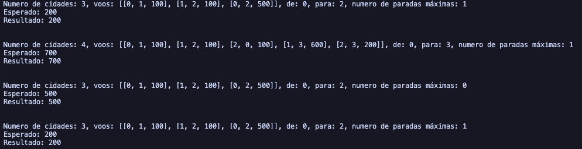

# Cheapest Flights Within K Stops

O desafio "Cheapest Flights Within K Stops" no LeetCode requer encontrar o custo mínimo para viajar de uma cidade de origem para uma cidade de destino, com a restrição de que o número de paradas intermediárias não pode exceder um valor k especificado.

## O problema

Dado um número n de cidades (numeradas de 0 a n-1) e uma lista de voos representados como arestas direcionadas com custos associados, o objetivo é determinar o custo mínimo para viajar de uma cidade src para uma cidade dst, fazendo no máximo k paradas intermediárias. Se não houver tal rota, o resultado deve ser -1.

## A resolução

A solução utiliza uma abordagem baseada no algoritmo de Bellman-Ford, que é adequado para grafos com arestas ponderadas. A ideia principal é iterar k + 1 vezes (pois k paradas significam k + 1 voos) e, em cada iteração, atualizar os custos mínimos para alcançar cada cidade a partir da cidade de origem.

## Captura de tela

## Conclusão

A abordagem de Bellman-Ford é eficaz para este problema, permitindo calcular o custo mínimo com a restrição de paradas. A complexidade de tempo é O(k \* E), onde E é o número de voos, e a complexidade de espaço é O(n) devido à lista de preços.
