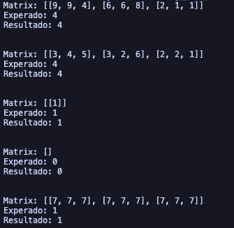

# Longest Increasing Path in a Matrix

## O problema

Dado um matriz de inteiros, encontre o comprimento do caminho crescente mais longo na matriz. Você pode mover-se em quatro direções (cima, baixo, esquerda, direita) a partir de uma célula, mas não pode se mover diagonalmente ou para fora dos limites da matriz.

## A resolução

Para resolver este problema, podemos usar uma abordagem de busca em profundidade (DFS) combinada com memorização para evitar cálculos redundantes. A ideia é explorar cada célula da matriz e calcular o comprimento do caminho crescente mais longo. Utilizamos uma matriz auxiliar para armazenar os resultados já calculados para cada célula, o que nos permite reutilizar eles em vez de recalculá-los.

## Capturas de tela

## Conclusões

A abordagem DFS é eficiente para este problema, pois reduz significativamente o número de cálculos necessários. A complexidade de tempo é O(m _ n), onde m e n são as dimensões da matriz, já que cada célula é processada no máximo uma vez. A complexidade de espaço também é O(m _ n) devido à matriz de memoização. Esta solução é eficaz para matrizes grandes e pode ser aplicada a outros problemas semelhantes envolvendo caminhos em matrizes.
